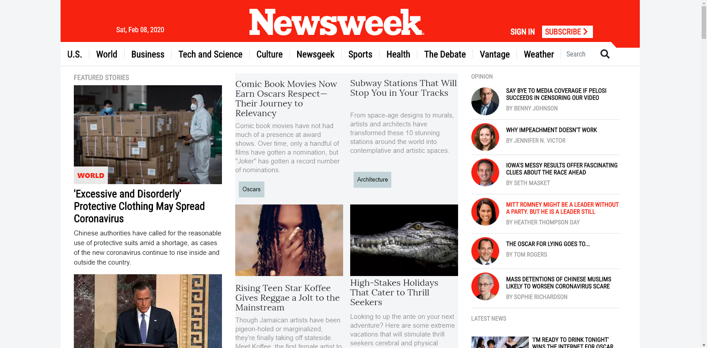

# Using bootstrap

> Project that I worked on to build my skills with layout and design using bootstrap.

## Built With

- HTML5 and CSS3
- VSCode, Linters, Stylelint, Validator.w3

## Live Demo

[Live Demo Link](https://rawcdn.githack.com/vzdrizhni/Using-Bootstrap/a3f8da5e3b7e6104ac52f0f692098c3425eec1f4/index.html)

### Prerequisites

- Get your browsers up to date

### Setup

- Clone the repository on your local machine
- cd into the folder, find the index.html file and open it

### Install

- Install VSCode or any code editor you like
- Install Node JS and nmp(most recents versions)
- Run this command on your terminal in order to install stylelint: npm install stylelint stylelint-config-recommended --save-dev 

### Usage

### Run tests

- Test the css by typing the command: npx stylelint .
- Go to http://validator.w3.org/ , upload the index.html file to test it.

### Deployment

- Get an online web hosting
- Upload all the files in the htdocs folder of your domain
- Access your domain name in browser

## Author

👤 Roman Nikolaev 

- Github: [@githubhandle](https://github.com/vzdrizhni)
- Twitter: [@twitterhandle](https://twitter.com/twitterhandle)
- Linkedin: [linkedin](https://twitter.com/metabruta)

## 🤝 Contributing

Contributions, issues and feature requests are welcome!

Feel free to check the [issues page]().

## Show your support

Give a ⭐️ if you like this project!

## 📝 License
